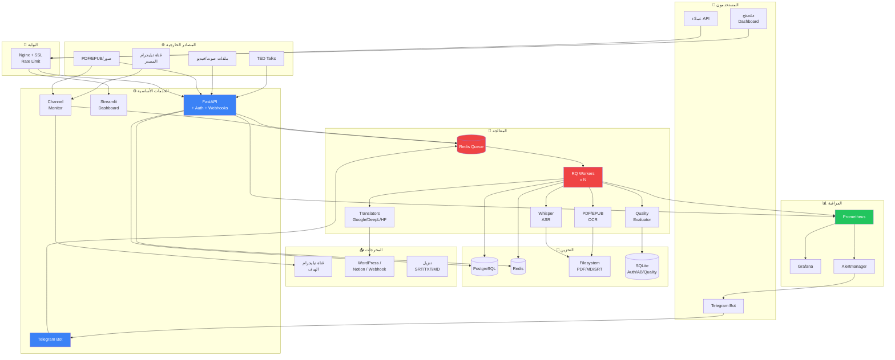
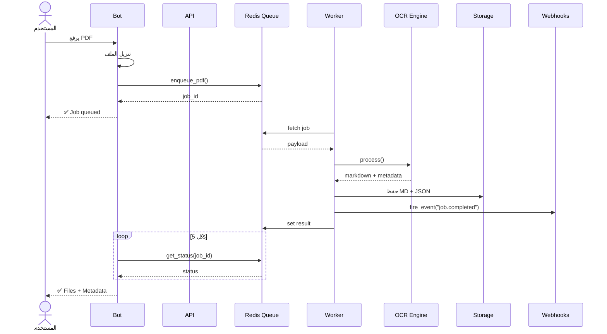

# المخطط المعماري — Marathon TED Pipeline



مخطط تسلسلي: رفع PDF من البوت



مخطط معمارية النشر على Kubernetes

```mermaid
graph LR
    subgraph Internet
        USER[المستخدم]
    end

    subgraph K8s["☸️ Kubernetes Cluster"]
        ING[Ingress<br/>nginx]
        subgraph NS["namespace: marathon"]
            API_POD[API Pods x3<br/>HPA: 2-10]
            WRK_POD[Worker Pods x4<br/>HPA: 2-20]
            BOT_POD[Bot Pod x1]
            MON_POD[Monitor Pod x1]
            PG_POD[(Postgres<br/>StatefulSet)]
            RD_POD[(Redis)]
            PVC[(PVC<br/>50Gi)]
        end
    end

    subgraph Monitor["📊 مراقبة"]
        PROM[Prometheus]
        GRAF[Grafana]
    end

    USER --> ING
    ING --> API_POD
    API_POD --> RD_POD
    RD_POD --> WRK_POD
    WRK_POD --> PVC
    API_POD --> PG_POD
    WRK_POD --> PG_POD
    API_POD -.->|metrics| PROM
    WRK_POD -.->|metrics| PROM
